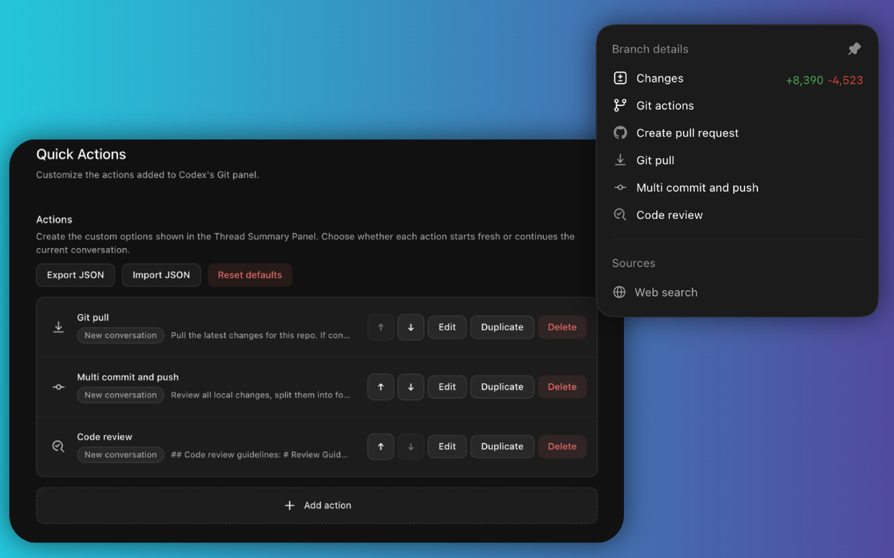

# Quick Actions



Quick Actions is a Codex++ tweak that adds customizable workflow actions to Codex's Git panel.

Each action can either open a new Codex conversation or run in the current conversation, then send the prompt you configured. It also keeps a right-edge fallback for Codex's Thread Summary Panel when Codex does not render the native panel on fresh project threads.

## Features

- Add custom actions to the Git panel
- Configure each action's title, prompt, icon, conversation target, and send mode
- Use prompt variables like `{repo}`, `{branch}`, `{cwd}`, `{date}`, and `{selectedText}`
- Reorder with drag and drop, duplicate, edit, delete, and reset actions from Codex++ settings
- Import and export action presets as JSON; imports merge by action id
- Persist actions through Codex++ tweak storage
- Built-in defaults for Git pull, multi-commit push, and code review

## Install

Clone this repository into your Codex++ tweaks directory:

```sh
cd "$HOME/Library/Application Support/codex-plusplus/tweaks"
git clone https://github.com/ImSakushi/codex-plusplus-quick-actions.git co.sakushi.quick-actions
```

Then enable **Quick Actions** from Codex++ Tweaks.

## Configure

Open Codex settings, go to **Quick Actions**, then add or edit actions. Actions without a prompt stay in settings but are not shown in the Git panel.

Choose **New conversation** for actions that should start fresh, or **Current conversation** for prompts that should continue the active thread. Enable **Confirmation before send** on actions that should only prefill the composer. Leave it off for actions that should submit immediately.
